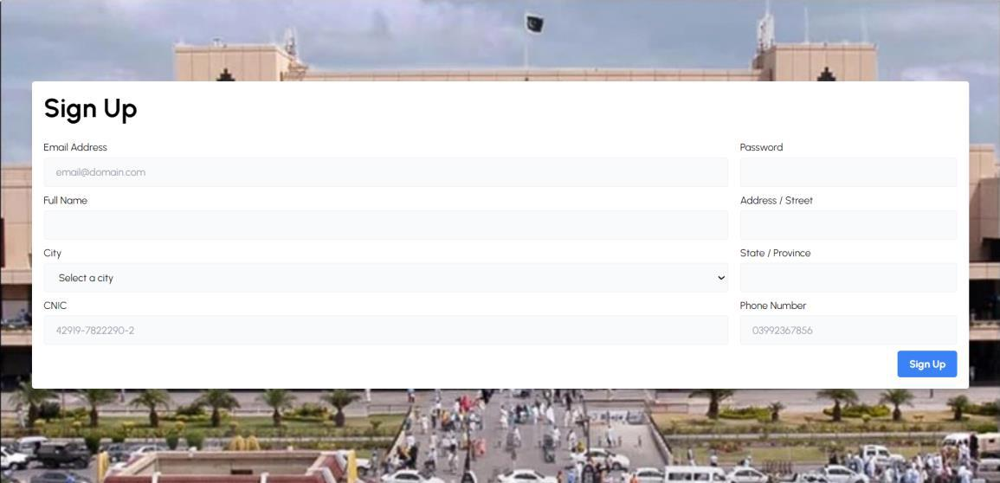
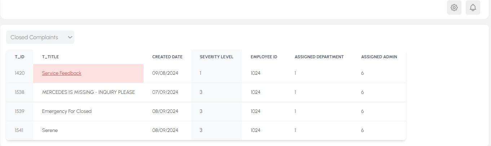

# 🛠️ Complaint Management System – Civil Aviation Authority (CAA)

A **Complaint Management System** developed for the **Civil Aviation Authority of Pakistan** to streamline the process of handling, tracking, and resolving user complaints.  
Built with **ReactJS**, **.NET Core Web API**, and **SQL**, the platform ensures transparency, accountability, and efficient communication between users and administrators.  

---

## 📑 Abstract
The Complaint Management System is designed to **digitize and automate** complaint handling for the Civil Aviation Authority.  
It provides a **user-friendly dashboard** for complaint tracking, real-time updates, admin monitoring, analytics, and automated notifications.  
Super Admins can oversee sub-admins, assign tickets to relevant departments, and prioritize issues for timely resolution.  

This system improves **operational efficiency, user satisfaction, and decision-making** through transparency and data-driven insights.

---

## 🚀 Tech Stack
- **Frontend:** ReactJS  
- **Backend:** .NET Core Web API  
- **Database:** SQL Server  
- **Architecture:** Modular (Frontend + Backend + Database)  

---

## 📌 Features
### 👤 User Features
- Dashboard with complaint status boxes (Open, Closed, Resolved, Pending)  
- Register new complaints via ticket system  
- Real-time communication with assigned admin  
- Close complaints and provide feedback upon resolution  
- Receive **automated notifications** when admins respond  

### 🛡️ Admin Features
- **Super Admins**:
  - View/manage all tickets  
  - Assign complaints to relevant departments or sub-admins  
  - Set ticket priorities & cancel invalid complaints  
  - Monitor sub-admin performance  
- **Sub Admins**:
  - Manage assigned complaints  
  - Update complaint status (resolved, pending, etc.)  
  - Ensure transparency by keeping users updated  

### 📊 System Features
- Feedback collection & analytics  
- Performance tracking of sub-admins  
- Secure authentication & validation  
- Notification system for timely updates  

---

## 🖼️ User Interface Screenshots

### 👤 User Interface
| Feature | Screenshot |
|---------|------------|
| Splash Screen |  |
| Login |  |
| Sign Up |  |
| Dashboard |  |
| Add New Complaint |  |
| Complaints |  |
| Ticket Details |  |
| My Profile |  |
| Contact Us |  |

---

### 🛠️ Sub-Admin Interface
| Feature | Screenshot |
|---------|------------|
| Dashboard |  |
| All Complaints |  |

---

### 🏢 Super-Admin Interface
| Feature | Screenshot |
|---------|------------|
| Dashboard |  |
| All Complaints |  |
| Ticket Details |  |

---

## 🗂️ ER Diagram

---
